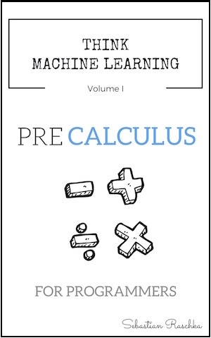

# An Introduction to the Mathematics of Machine Learning

**Develop your mathematical intuition for machine learning algorithms! This book guides you through the fundamentals of linear algebra, calculus, optimization theory, probability theory, and statistics using hands-on code examples, and well-chosen exercises.**

This complementary GitHub repository contains the exercises, code examples, and additional info material for *Think Machine Learning Volume 1: Precalculus for Programmers.*

## Links

- [https://leanpub.com/math-for-machinelearning](https://leanpub.com/math-for-machinelearning)

## About the book

- Publication date: est. Q2 2017
- Formats: epub, mobi, paperback
- Pages: 450 (paperback)
- ISBN-10: [TBA]
- ISBN-13: [TBA]
- ASIN: [TBA]

Sadly, I have to admit that I counted mathematics towards the most boring and tedious subjects in High School. I was never really bad at it, but I only participated at a minimum level just to keep my grades in the "okay" range. I think the reason behind it was that I was simply missing the context. I knew that the concepts were somewhat important, but just solving equations for the purpose of solving equations (or to get good grades) never really clicked with me; physics, biology, and chemistry were so much more exciting!

To me, math classes were so boring because they were missing a simple yet important ingredient: Applications. I don't want to blame my math teacher though, I believe he was highly constraint by a strict curriculum.Luckily, although much later in my career, I discovered the true beauty of math -- in the context of studying machine learning. With this book, I want to transfer some of my excitement and passion on to you! Many people from many different fields heard about the usefulness of machine learning techniques and are just about to dive deeper into the material. However, without a strong math background, most of the literature can be really overwhelming.

"But there are many practical machine learning books out there that don't involve math at all, so why should I bother?" Good question! We don't need to become experts in applied mathematics to use machine learning techniques. However, I think that certain basics can be of great benefit helping us to navigate through the forest of common pitfalls. Also, being able to read, understand, interpret, and analyze machine learning algorithms makes applications of machine learning far more interesting. Getting good at math may be a little investment upfront, however, it can save time in the long run on by helping us to find the "optimal" solution to our real-world problem tasks more readily.
